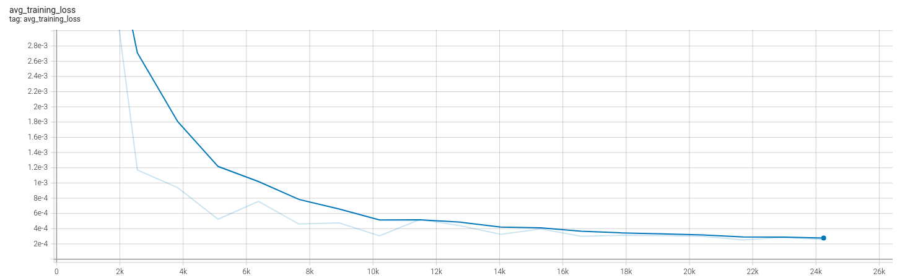
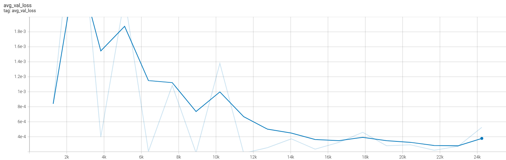
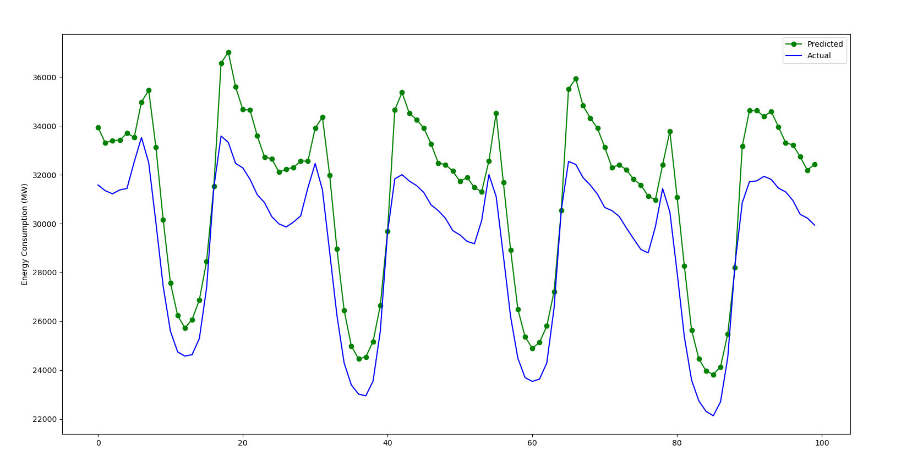
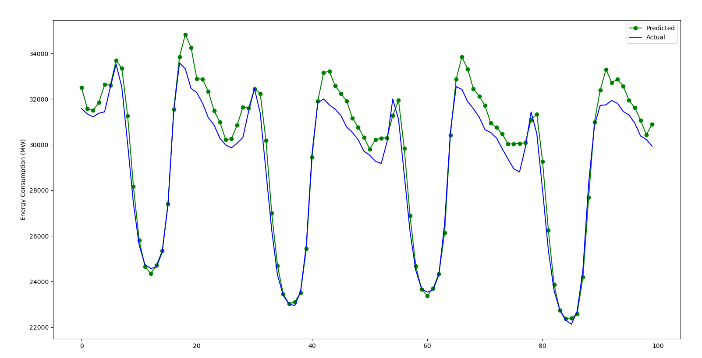

# energy_prediction
## Introduction
This repository is an experiment sandbox using the dataset "Hourly Energy Consumption" found on Kaggle: https://www.kaggle.com/datasets/robikscube/hourly-energy-consumption.

The data set contains over 10 years of hourly energy consumption data from PJM in Megawatts:


## Setup
Run the following command:

```bash
pip install . 
```

## Results
### LSTM
Training was carried out with early stopping on the validation loss at a patience of 10. The amount of historical data being used to make a prediction on the next hour was 90 hours. The training and validation curves are below:





We can see the the loss converged very quickly and the best epoch based on validation loss was around epoch 8.

Evaluation was run on two models using the test set one from epoch 4 and one from epoch 8, to confirm the improvement in performance during in training.

The sMAPE (Symmetric Mean Absoltute Percentage Error) was 0.69% for epoch 8 and 1.6% for epoch 4.

A random sample of the test has been plot to see those results below:

### Epoch 4 Predictions


### Epoch 8 Predictions


It is clear to see from the predictions that, as expected, the model at epoch 8 produces better predictions overall. In both cases the model makes better predictions as the energy usage transitions from decreasing to increasing. Both models also struggle more with the usage transitioning from increasing to decreasing.

## Licence
energy_prediction uses a [Apache 2.0 License]((https://github.com/TomW1495/energy_prediction/blob/main/LICENSE))